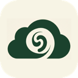

<p align="center">
  
</p>

# Granola Sync

Export your [Granola](https://granola.ai) meetings to Google Drive as `.docx`, `.md`, or `.txt` files.

**Features:**
- Reads meetings from Granola's local cache
- Falls back to the Granola API for transcripts not in cache
- Generates styled `.docx`, Markdown, or plain text exports with summary, notes, and full transcript
- Meeting browser with search, sort, and bulk export
- Dashboard with sync stats, charts, and activity heatmap
- Tracks exports to avoid duplicates
- macOS menu bar app with status display and one-click export
- Full windowed app with dashboard, meeting browser, export history, log viewer, and settings
- First-run setup wizard with Google Drive auto-detection
- Scheduled automatic exports via launchd

## Install

### Homebrew (recommended)

```bash
brew tap mahmoudsalim/granola
brew install --cask granola-sync
```

### DMG Download

Download the latest `.dmg` from [GitHub Releases](https://github.com/mahmoudsalim/granola-sync/releases), drag to Applications, right-click > Open on first launch.

### CLI Only (no GUI)

```bash
pip install granola-sync
granola-sync config init
granola-sync export
```

### From Source

```bash
git clone https://github.com/mahmoudsalim/granola-sync.git
cd granola-sync
bash scripts/install.sh
```

## Usage

### GUI

Launch **GranolaSync.app** — a menu bar icon appears. Click it for quick status and one-click export. Use "Open Window" for the full dashboard with settings, export history, and configuration.

On first launch, a setup wizard guides you through:
1. Detecting your Granola installation
2. Selecting your Google Drive export folder
3. Choosing a sync schedule

### CLI

```bash
granola-sync export              # Export new meetings
granola-sync export --json       # JSON output (for scripting)
granola-sync export --ids ID1,ID2 --force  # Export specific meetings
granola-sync list                # List all meetings in cache
granola-sync list --json         # JSON list (for scripting)
granola-sync show <doc_id>       # Show meeting details
granola-sync show <doc_id> --json
granola-sync stats               # Show sync statistics
granola-sync stats --json        # JSON stats
granola-sync status              # Show sync status
granola-sync status --json       # JSON status
granola-sync config show         # Show current config
granola-sync config set drive_path "~/path/to/drive"
granola-sync config init         # Auto-detect and create config
granola-sync config validate     # Check config validity
granola-sync launchd install     # Install scheduled exports
granola-sync launchd uninstall   # Remove scheduled exports
granola-sync launchd status      # Check launchd status
granola-sync version             # Show version
```

## Configuration

Config file: `~/Library/Application Support/GranolaSync/config.json`

```json
{
  "version": 1,
  "drive_path": "~/Library/CloudStorage/GoogleDrive-.../My Drive/Meetings",
  "granola_cache_path": "~/Library/Application Support/Granola/cache-v3.json",
  "granola_auth_path": "~/Library/Application Support/Granola/supabase.json",
  "schedule_interval": 1209600,
  "notifications_enabled": true,
  "export_format": "docx",
  "api_url": "https://api.granola.ai/v1"
}
```

The Swift app and Python CLI share this same config file. Changes made in the GUI are immediately available to the CLI and vice versa.

## Architecture

```
Swift App (menu bar + windowed GUI)
    ↕ subprocess (JSON protocol)
Python CLI (granola-sync export --json)
    ↕ file I/O
Config: ~/Library/Application Support/GranolaSync/config.json
```

The Swift app handles all UI. Python handles all export logic. They communicate via subprocess — Swift runs `granola-sync` CLI commands with `--json` flag and parses structured JSON responses.

## Development

```bash
# Setup
python3 -m venv .venv
source .venv/bin/activate
uv pip install -e python/ pytest

# Run tests
pytest python/tests/ -v

# Build app
make app

# Build + install to /Applications
make install

# Full dev install (Python + Swift + bundle)
make dev-install
```

## Requirements

- macOS 14.0+
- Python 3.11+
- [Granola](https://granola.ai) installed
- [Google Drive for Desktop](https://www.google.com/drive/download/) running

## License

MIT
